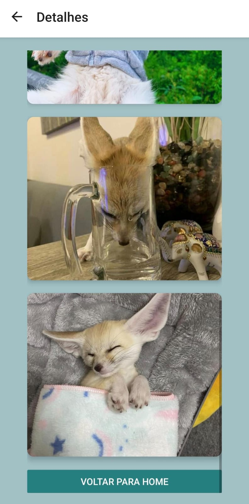

# Exercício 05

Este repositório contém a solução para o **Exercício 05**.


## Estrutura de Arquivos

- `assets/print-atv05/`: Contém as imagens relacionadas ao exercício.

## Imagens

### Capturas de Tela
 
#### 1 | Primeira página Home, ao pressionar no botão "Ir para Detalhes" ele encaminhara para a página "Detalhes"

#### 2 | Página Detalhes exibida ao pressionar no botão



## Como Executar

1. Clone o repositório:
    ```bash
    git clone <https://github.com/gihcaron/ATV05-Mobile>
    ```
2. Navegue até o diretório do projeto:
    ```bash
    cd exercicio05
    ```
3. Siga as instruções do exercício.

